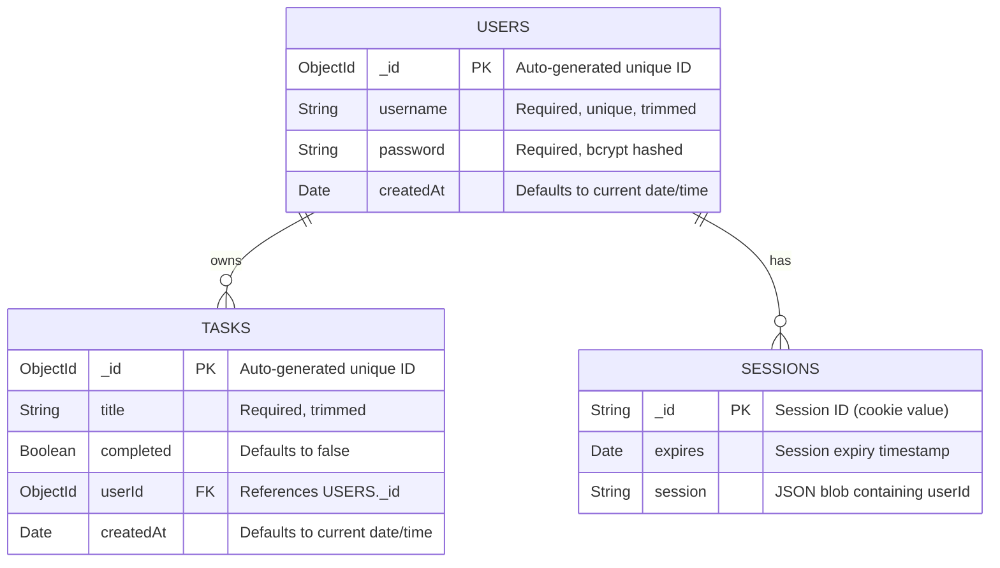

# Entity Relationship Diagram — Student Task Manager

## Collections Overview

The database (`task-manager`) contains three collections managed by MongoDB:

| Collection | Managed by | Purpose |
|------------|-----------|---------|
| `users` | Mongoose (`User` model) | Stores registered user accounts |
| `tasks` | Mongoose (`Task` model) | Stores tasks belonging to users |
| `sessions` | `connect-mongo` | Stores active login sessions |

---

## ERD (Mermaid)



---

## Relationships Explained

### USERS → TASKS (`one-to-many`)

```
One USER owns zero or many TASKS.
Each TASK belongs to exactly one USER.
```

- The link is stored on the **TASKS** side via the `userId` field
- `userId` holds the `_id` of the user who created the task
- Every database query for tasks filters by `userId` to enforce ownership
- If you look up a task, you know its owner. If you look up a user, you can find all their tasks by searching `tasks` where `userId = user._id`

**Example documents:**

```json
// users collection
{ "_id": "64a1...", "username": "alice", "password": "$2a$10$...", "createdAt": "2026-05-11T..." }

// tasks collection
{ "_id": "64b2...", "title": "Study React", "completed": false, "userId": "64a1...", "createdAt": "2026-05-11T..." }
{ "_id": "64b3...", "title": "Submit lab report", "completed": true,  "userId": "64a1...", "createdAt": "2026-05-11T..." }
```

`tasks.userId → users._id` is the foreign key relationship.

---

### USERS → SESSIONS (`one-to-many`)

```
One USER can have zero or many active SESSIONS.
Each SESSION belongs to exactly one USER.
```

- Sessions are created and managed automatically by `express-session` + `connect-mongo`
- The `session` field inside each document is a JSON string that contains `{ userId: "64a1..." }`
- When a request arrives, Express reads the session cookie, looks up the session document in MongoDB, extracts `userId`, and makes it available as `req.session.userId`
- Sessions expire automatically after 24 hours (`maxAge: 1000 * 60 * 60 * 24`)

**Example document:**

```json
// sessions collection
{
  "_id": "s%3AaBcD...",
  "expires": "2026-05-12T10:00:00.000Z",
  "session": "{\"cookie\":{\"httpOnly\":true,\"maxAge\":86400000},\"userId\":\"64a1...\"}"
}
```

---

## Field-by-Field Reference

### `users` collection

| Field | Type | Constraint | Notes |
|-------|------|-----------|-------|
| `_id` | ObjectId | Primary Key | Auto-generated by MongoDB |
| `username` | String | Required, Unique | Indexed for fast lookup; duplicates rejected |
| `password` | String | Required | Stored as a bcrypt hash, never plain text |
| `createdAt` | Date | Default: `Date.now` | Set automatically on first save |

### `tasks` collection

| Field | Type | Constraint | Notes |
|-------|------|-----------|-------|
| `_id` | ObjectId | Primary Key | Auto-generated by MongoDB |
| `title` | String | Required | Whitespace trimmed automatically |
| `completed` | Boolean | Default: `false` | Toggled by PATCH `/api/tasks/:id` |
| `userId` | ObjectId | Required, FK → `users._id` | Links the task to its owner |
| `createdAt` | Date | Default: `Date.now` | Used to sort tasks oldest-first |

### `sessions` collection

| Field | Type | Notes |
|-------|------|-------|
| `_id` | String | The session ID stored in the browser cookie |
| `expires` | Date | MongoDB TTL index removes expired sessions automatically |
| `session` | String | JSON string containing cookie metadata and `userId` |

---

## How the `userId` Foreign Key Works in Code

When a user logs in, the backend stores their ID in the session:
```js
// authController.js — login / signup
req.session.userId = user._id;
```

On every protected request, the middleware reads it back:
```js
// middleware/requireAuth.js
if (!req.session.userId) return res.status(401).json({ error: 'Not authenticated' });
```

Every task query uses it as a filter — users can never access another user's tasks:
```js
// controllers/taskController.js
Task.find({ userId: req.session.userId })
Task.findOneAndDelete({ _id: req.params.id, userId: req.session.userId })
```
